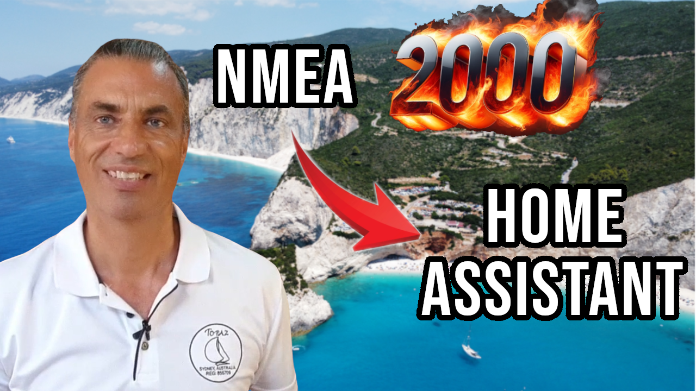

# ha-smart2000esp

## NMEA 2000 ESP32 Integration for Home Assistant

The **ha-smart2000esp** integration lets **Home Assistant** receive live **NMEA 2000 (CAN bus)** data over Wi-Fi using an ESP32 with a CAN transceiver. Place it near your N2K backbone and stream engine data, tank levels, wind, depth, GPS, and other marine instruments directly into your dashboards. Perfect for **Raspberry Pi**-based central marine computers and boat automation projects where running cables is difficult or you want a flexible, wireless solution.

📖 **General NMEA 2000 article:** [NMEA 2000 – Home Assistant with ESP32 & USB-CAN](https://smartboatinnovations.com/nmea-2000-home-assistant-esp32-usb-can/)  
🔗 **Integration setup guide:** [NMEA 2000 ESP32 integration guide](https://smartboatinnovations.com/code/smart2000-esp32/)  
💡 **Related project:** [Build a Central Marine Computer](https://smartboatinnovations.com/build-central-marine-computer/)  
🌐 **Smart Boat Innovations homepage:** [smartboatinnovations.com](https://smartboatinnovations.com)  

🎥 **Video tutorial:** [Watch on YouTube](https://youtu.be/t1qDKVBHRrs)

---

### About Smart Boat Innovations
I'm Rob, a sailor and tech enthusiast with over 20 years of global sailing experience and a Computer Science degree. At **Smart Boat Innovations**, we focus on open-source marine electronics, **Raspberry Pi**, **ESP32**, **NMEA 0183**, **NMEA 2000**, and **Home Assistant** projects that make boating smarter, safer, and more affordable.

💬 Subscribe to our [YouTube channel](https://www.youtube.com/@SmartBoatInnovations) for more projects, ideas, and tutorials.  

🧭 Join the discussion on [r/smartboating on Reddit](https://www.reddit.com/r/smartboating)

☕ If you’ve found this useful, you can [support my work on Ko-fi](https://ko-fi.com/smartboatinnovations).
